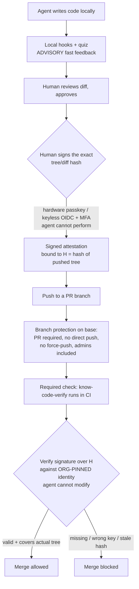

# know-code — threat model, red-team findings & remediation plan

_Status: draft, 2026-08-11. Author: red-team pass over v0.3.0. Internal (repo-tracked, not the published site)._

This document records (1) an honest statement of what know-code can and cannot
guarantee, (2) the findings from an adversarial + QA pass over v0.3.0, and (3) a
phased plan to turn know-code from a *procedural* gate into an *enforceable*
one. It supersedes the short "Threat model" comment in
`packages/cli/src/seal.ts` — keep that comment in sync with the summary here.

---

## 1. What know-code actually guarantees

**Honest claim.** know-code produces an **attestation that a human approved a
specific diff**, and makes the reviewed path the path of least resistance. It
does **not**, and cannot, *prove comprehension* — a quiz score is data, not
proof. The security-relevant artifact is "human identity X approved exactly
content H," not "X understood H."

**Current reality (v0.3.0).** All enforcement is **local, same-UID state**:

| Layer | Where it lives | Who can write it |
|-------|----------------|------------------|
| Policy (`requireAttest`, `requireTrailer`, …) | `.know-code/config.json` (gitignored, unsigned) | the agent |
| Trust anchor (human pubkey) | `~/.know-code/attest/<repoId>/meta.json` | the agent (same UID) |
| Encrypted private key | `~/.know-code/attest/<repoId>/private.enc` | the agent can read/replace |
| Git hooks | `.git/hooks/{pre-commit,pre-push}` | the agent |
| Agent shell hook | `.cursor/hooks.json`, `.claude/…`, `.codex/…` | the agent |
| CI check | `.github/workflows/*.yml` | the agent (in a PR) |

A coding agent runs with the **same OS user** as the developer. It can therefore
modify or disable **every** layer above. No amount of local cleverness changes
this: **you cannot do trusted enforcement on an endpoint the adversary fully
controls.** The v0.3.0 `seal.ts` threat model concedes the narrowest form of
this ("replacing `~/.know-code/attest` on disk"); the findings below show the
concession is actually much broader, and that the product framing + one guard
overstate the protection.

---

## 2. Red-team findings (v0.3.0)

Verified by execution in isolated throwaway repos with an isolated
`KNOW_CODE_ATTEST_HOME` (no network, no touch to the real repo). "Effort" is the
attacker effort to fully ship unreviewed code to a protected branch.

| ID | Finding | Severity | Class | Effort |
|----|---------|----------|-------|--------|
| KC-SEC-00 | **Systemic:** all enforcement is local, agent-writable state; no off-machine anchor | Critical | design | — |
| KC-SEC-01 | `attest-init --force` re-keys the anchor; the `assertNotAgentHook` guard never fires in a normal agent shell | Critical | guard bug + conceded | one command |
| KC-SEC-02 | `config set requireAttest false` disables sealing entirely (unsigned, gitignored policy) | Critical | design | one command |
| KC-SEC-03 | CI `verify` checks trailer **hashes**, not human **seals** → self-sealed commits pass CI | High | design | — |
| KC-SEC-04 | Shell hook evaded by `eval "git commit …"` / `g=git; $g commit` (should_gate regex gap) | Medium | impl gap | one command |
| KC-SEC-05 | Shipped `.cursor/hooks.json` uses the narrow matcher (add/merge/reset/stash/rebase not gated); all matchers miss `command git …` | Medium | config drift + inherent | one command |
| KC-SEC-06 | `--no-verify` defeats the git hooks; only the (evadable) shell hook remains | Low | inherent to git | one command |
| KC-SEC-07 | Renaming/moving the repo dir silently invalidates attestation (`repoId = sha256(absolute path)`) | Medium | UX footgun | n/a |
| KC-SEC-08 | `status` prints `sealed=no` / `allowed: no` for a validly signed gate (conflates check result with seal validity) — GH #2 | Low | UX | n/a |
| KC-SEC-09 | Corrupt `gate.json` is silently treated as "no gate" by `status`/`check` (only `commit`/`amend` surface it) | Low | UX | n/a |

### Detail & repro

**KC-SEC-01 — agent re-keys the anchor.**
`assertNotAgentHook` only checks `process.env.KNOW_CODE_HOOK_FORMAT`
(`packages/cli/src/seal.ts`). That var is set **only inline for the hook
script** (`.cursor/hooks.json`: `KNOW_CODE_HOOK_FORMAT=cursor bash …`), never in
the agent's normal shell, and `attest-init` isn't a gated command so the hook
doesn't run for it anyway.
```
know-code attest-init --force --passphrase AGENT-PICKED   # rotates the human key
KNOW_CODE_ATTEST_PASSPHRASE=AGENT-PICKED know-code taught
# write quiz.json + answers.json + grade-proposal.json
KNOW_CODE_ATTEST_PASSPHRASE=AGENT-PICKED know-code grade --accept
KNOW_CODE_ATTEST_PASSPHRASE=AGENT-PICKED know-code pass
know-code commit -m "feat: reviewed"   # grounded trailer, pre-commit passes
git push                                # pre-push passes → unreviewed code shipped
```
(Confirmed: unreviewed `evil.txt` pushed.) The direct-file equivalent —
overwrite `meta.json` + `private.enc` — is the "conceded" version; `--force` is
just the convenient CLI, and its guard is meant to stop exactly this.

**KC-SEC-02 — flip the policy off.**
`.know-code/config.json` is gitignored and unsigned. With `requireAttest:false`,
`sealPayload` returns the payload unsigned and `isSignedGateOpen` returns `true`
without any seal. Confirmed: `know-code config set requireAttest false` then the
full pipeline with **no passphrase** ships unreviewed code.

**KC-SEC-03 — CI is not a backstop.**
In the attacked repo, `know-code verify` returned exit 0 ("HEAD trailer
verified"). `verify` recomputes the diff hash and checks the trailer matches —
which `know-code commit` produces legitimately. It never verifies a human
Ed25519 signature, so it cannot tell a human-passed commit from a self-sealed
one. This is the crux: **the one layer the agent doesn't fully control (CI)
isn't checking the thing only a human can produce.**

**KC-SEC-04 — shell-hook indirection.**
On a closed gate, `check-shell.sh` correctly denied `git commit`,
`git commit --no-verify`, `git push`, `command git commit`, `--amend`, and
`-c core.hooksPath=…`, but **allowed** `eval "git commit -m x"` and
`g=git; $g commit -m x`. `should_gate`'s regex requires a literal `git` after
whitespace/`;|&`; quoting/variable indirection slips it. Harmless alone (git
pre-commit still fires) but composes with `--no-verify` (KC-SEC-06) into a
full bypass with no key work.

**KC-SEC-05 — matcher drift + inherent evasion.**
`init` generates the broad `CURSOR_MATCHER` (covers add/pull/merge/rebase/
cherry-pick/reset/stash), but this repo's checked-in `.cursor/hooks.json`
matches only `commit|push|pr create`. Also, every `beforeShellExecution`
matcher misses `command git …`. Claude/Codex use `matcher:"Bash"` (always run
the hook) so they depend only on `should_gate` (KC-SEC-04).

**KC-SEC-06 — `--no-verify`.** Inherent to git; confirmed
`git commit --no-verify && git push --no-verify` ships on a closed gate. The
only catch is the shell hook, which KC-SEC-04/05 show is evadable.

**KC-SEC-07 — moved repo.** `repoAttestId = sha256(repoRoot).slice(0,32)`
(`packages/cli/src/seal.ts`). After `mv`/copy, `status` says
`attest: Attest key not initialized` + `Gate seal invalid`, and `taught` says
`no attest key — run attest-init`. No hint that the key is intact under the old
path; following the advice mints a new key and orphans the old seals.

**KC-SEC-08 / KC-SEC-09** — see GH #2; corrupt `gate.json` is swallowed to
`null` by `readGateSafe` so `status`/`check` show generic reasons.

### What held up (no bug)
Unborn HEAD, no remote, non-ASCII/spaced filenames, `hash --explain`,
`doctor --strict`, `reset`, and all forge/replay attempts **against signed
artifacts** (the crypto is sound). Defaults are the safe ones
(`requireAttest`/`enforcePipeline`/`requireGradeProposal` = true). The bypasses
come from rewriting the anchor, never from forging against it.

---

## 3. Can know-code be made enforceable? Yes — but only off-machine.

The trust boundary must move to something the agent does not control. On a
GitHub stack there are exactly three such places:

1. **The remote server** — branch-protection rules / rulesets and **required
   status checks** are enforced by GitHub, not the developer's machine.
2. **CI runners' secrets / OIDC identity** — with workflow-tamper protection.
3. **A human identity the agent can't wield** — a hardware-backed key
   (passkey/WebAuthn, Secure Enclave, TPM, YubiKey) or keyless OIDC with MFA,
   where signing needs a human gesture the agent can't perform silently.

The enforceable design combines all three:



**Why each attack now fails:**
- KC-SEC-01/02/F (re-key / config flip / meta overwrite): the verifier trusts an
  **org-pinned** identity (a GitHub ruleset, an org/repo *environment* value, or
  a CODEOWNERS-guarded allowlist), **not** a repo-tree or `~/.know-code` file.
  Rotating the local key or flipping local config changes nothing the verifier
  trusts; the signature no longer matches the pinned identity → merge blocked.
- KC-SEC-03: CI verifies a **human signature over the exact pushed tree**, not a
  self-computable trailer hash.
- KC-SEC-04/05/06 (local hook evasion, `--no-verify`): irrelevant to landing —
  the agent may commit/push anything to a *branch*, but **cannot merge to the
  protected base** without the signature + green required check.

**Signing options (pick one), strongest fit first:**
- **Keyless OIDC (Sigstore `gitsign`)** — human signs commits by authenticating
  to an IdP with MFA; a short-lived cert binds their identity; Rekor logs it. CI
  verifies the cert identity ∈ an allowlist. No key files to steal or rotate; the
  agent can't obtain the human's MFA'd OIDC identity. Best DX/ops trade-off.
- **WebAuthn/passkey attestation** — human approves the diff hash on a registered
  authenticator (touch/biometric). Requires a tiny approval surface that shows
  the human *what* they're signing (transaction binding: WebAuthn `challenge` =
  the tree hash, human sees the change summary). Strongest against a compromised
  endpoint.
- **Hardware SSH/GPG commit signing** with keys registered at the **org** level;
  CI verifies against the org allowlist (not the user's account settings).

**Closing the workflow-tamper hole (required for 2/3 to hold):** an agent can
edit `.github/workflows/*` in its PR. Defenses, all server-side:
- Make `know-code-verify` a **required** check by name → deleting/neutering the
  workflow means the check never reports success → PR can't merge (not "passes").
- Post the check from a **GitHub App / OIDC-verified identity**, not the default
  `GITHUB_TOKEN`, so a status can't be spoofed by a workflow the agent edits.
- Require **CODEOWNERS review** for `.github/**` and the identity allowlist; or
  call a **reusable workflow pinned by SHA** from a separate protected repo.

**The ceiling (out of scope even then):** MFA/passkey *phishing where the human
approves the agent's hash believing it's theirs* (mitigated by transaction
binding — show the diff), malware at higher privilege than the user, a
compromised CI provider, an **admin** disabling branch protection, or a stolen
hardware token + PIN. And forever: this proves *approval of content*, not
*comprehension* — the quiz stays a social ritual whose score is advisory.

---

## 4. Remediation plan

Phased so the trivial bypasses die immediately and the real boundary lands
incrementally. Each item lists acceptance criteria.

### Phase 0 — Honesty (docs only, ship in 0.3.1)
Stop overclaiming; this is the most important immediate fix.
- Rewrite `seal.ts` threat-model comment + `website/docs/how-it-works.md` +
  `intro.md` to state: **local layers are advisory; enforcement requires the
  server-side check (Phase 2+).** (KC-SEC-00, 03)
- Add a "Security model & limitations" doc page derived from §1–§3 here.
- **Acceptance:** no doc/README/CLI text implies the local gate stops a
  determined agent; `doctor` prints an advisory-vs-enforced status line.

### Phase 1 — Kill the one-liners & stop the footguns (0.3.1)
Raises attacker effort and removes misleading guards; still local, still
ultimately bypassable — labeled as such.
- **KC-SEC-01:** `attest-init` (and especially `--force`) require a real
  interactive TTY (`process.stdin.isTTY`) and refuse `--passphrase`/
  `KNOW_CODE_ATTEST_PASSPHRASE` for `--force`; record previous `keyId` and print
  a loud rotation warning in `status`/`doctor`/`verify`. Fix
  `assertNotAgentHook` to not rely solely on an env var (also detect
  non-TTY + parent process heuristics) — documented as best-effort.
- **KC-SEC-02:** bind the effective policy into the gate receipt (sign
  `requireAttest`/level into `gate.json`); `status`/`doctor` flag when config
  was downgraded vs the sealed policy; server check (Phase 2) rejects a gate
  whose sealed policy is weaker than the repo's required policy.
- **KC-SEC-04:** broaden `should_gate`/`shouldGate` to catch `eval`, quoted, and
  `VAR=git; $VAR` / `command git` forms (best-effort), with a test matrix; doc
  that command interception is advisory.
- **KC-SEC-05:** fix this repo's `.cursor/hooks.json` to the broad
  `CURSOR_MATCHER`; add a `doctor` check that the installed matcher equals
  `CURSOR_MATCHER`; add a regression test.
- **KC-SEC-07:** detect `repoId` mismatch and print "an attest key exists for a
  different path — you likely moved the repo; re-point or re-attest" instead of
  "not initialized"; consider keying attest by a repo-stable id (root-commit OID)
  with a migration.
- **KC-SEC-08 (GH #2):** `status` reports receipt `sealed=` from signature
  validity, and always lists a blocker when `allowed:no`.
- **KC-SEC-09:** `status`/`check` surface corrupt `gate.json` explicitly.
- **Acceptance:** re-run the red-team battery — A/A'/F now require a TTY or raw
  file surgery (no clean one-command CLI path) and are loudly flagged in
  `status`/`doctor`; the shell-hook `eval`/`command` cases are denied; `doctor`
  fails on matcher drift.

### Phase 2 — Server-verified human seal (0.4.0, the real boundary)
- Extend `know-code verify` (the Action) to verify a **human signature over the
  pushed tree/diff hash** against a **trusted identity pinned outside the repo
  tree** (org/repo *environment* secret or CODEOWNERS-guarded allowlist), in
  addition to the trailer-hash check.
- Ship a documented **branch-protection / ruleset recipe**: PR required, require
  `know-code-verify`, block direct push + force-push to base, include admins,
  require CODEOWNERS review for `.github/**` and the allowlist.
- Emit the seal as a verifiable object (signed note on a `refs/know-code/*` ref
  or a signed trailer whose signature — not just hash — CI checks).
- **Acceptance:** on a real remote with the recipe applied, every red-team
  attempt (A, A', E, F, `--no-verify`) can still create commits/branches but
  **none can merge to the protected base**; a genuine human-signed PR merges.

### Phase 3 — Agent-unusable identity (0.4.x / 0.5.0)
- Integrate keyless-OIDC (`gitsign`/Sigstore) **or** WebAuthn passkey signing for
  the human `pass`/seal step, with **transaction binding** (the approval UI shows
  the diff summary + hash that gets signed).
- CI verifies the cert/authenticator identity ∈ org allowlist (+ Rekor for
  keyless).
- **Acceptance:** even with full local compromise (agent has the machine), it
  cannot produce a valid seal without a live human gesture; re-run battery →
  no merge.

### Out of scope (document, don't pretend to solve)
MFA/passkey phishing with matching content, higher-privilege malware,
compromised CI, admin disabling protection, stolen hardware+PIN, and proof of
*comprehension* (vs approval).

---

## 5. Issue tracking

Group into the four themes for the milestone:
- **Trust-anchor / CI-seal (Phase 2/3):** KC-SEC-00, 02, 03 — the enforceable
  design. (design spike → 0.4.0)
- **Guard effectiveness (Phase 1):** KC-SEC-01 (`attest-init` TTY + rotation
  warning), KC-SEC-02 (policy binding).
- **Local hook coverage (Phase 1):** KC-SEC-04 (`should_gate` indirection),
  KC-SEC-05 (matcher drift + `doctor` check).
- **UX correctness (Phase 1):** KC-SEC-07 (moved repo), KC-SEC-08 (GH #2),
  KC-SEC-09 (corrupt gate surfacing).

Existing: [#2](https://github.com/chtnnh/know-code/issues/2) (KC-SEC-08),
[#3](https://github.com/chtnnh/know-code/issues/3)–[#6](https://github.com/chtnnh/know-code/issues/6)
(0.3.1 polish). New issues to file: KC-SEC-00/01/02/03/04/05/07/09.
