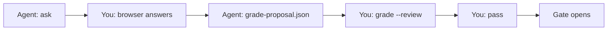

# Grading

know-code uses **agent-proposed grading** with **human review and attest**. You never self-assign a passing score — the agent proposes, you review and seal.

## Flow



| Step | Who | What |
|------|-----|------|
| 1 | **Agent** runs `ask` · **you** submit answers | `answers.json` |
| 2 | **Agent** | Reads answers + quiz + diff → writes `grade-proposal.json` |
| 3 | **You** | `know-code grade --review` (TUI: per-question scores + feedback) |
| 4 | **You** | Attest passphrase → sealed `grade.json` |
| 5 | **You** | `know-code pass` → sealed `gate.json` (gate opens) |

```bash
# Agent (after you submitted the browser quiz)
know-code grade propose --json    # optional rubric helper
# agent writes .know-code/grade-proposal.json

# You
know-code grade --review          # or --accept to skip score adjustment
know-code pass
```

## Pass bar

Overall score ≥ **0.8**. Below the bar, `grade --review` exits 2 — re-teach and re-quiz.

## `grade-proposal.json`

Written by the agent (unsigned). Binds `diffHash` and `answersDigest`. See the skill reference `grading-rubric.md` in the repo.

## Emergency self-score

Disabled by default (`allowSelfScore: false`). Enable only for emergencies:

```bash
know-code config set allowSelfScore true
know-code grade --score 0.85
```

## Config

| Field | Default | Meaning |
|-------|---------|---------|
| `requireGradeProposal` | `true` | Require agent proposal before human grade |
| `allowSelfScore` | `false` | Permit legacy `grade --score` |
