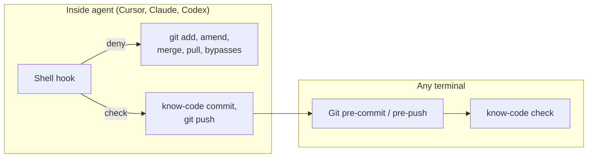

# Hooks

know-code gates shipping at two layers: **git hooks** (any terminal) and **agent shell hooks** (inside Cursor, Claude Code, Codex, …).

## Why two layers?

Git hooks catch every `git commit` and `git push`. Agent hooks go further: they stop the agent from **staging** (`git add`), **rewriting history** (`git commit --amend`), or **creating implicit commits** (`git merge`, `git pull`) that would bypass the quiz. You stage in your own terminal; the agent commits through `know-code commit` after you pass.



## Git hooks

Installed by `know-code init` (or refresh with `know-code hooks install`):

- **pre-commit** — runs `know-code check`
- **pre-push** — runs `know-code check --push`

Hooks unset `KNOW_CODE_COMMIT` so a leftover env var cannot skip trailer checks. During `know-code commit` / `amend`, Git writes the pending message (with grounded `Know-Code-Verified` trailer) to `COMMIT_EDITMSG` before `pre-commit`; `know-code check` accepts that pending trailer instead of requiring HEAD to already carry one. `pre-push` ignores `COMMIT_EDITMSG` and requires the trailer on HEAD. Shipping also requires `HEAD^{tree}` / index tree to match `gate.gatedTreeOid`.

Refresh after upgrading the CLI (required after **0.3.0**):

```bash
know-code hooks install
know-code init --agents cursor,claude,codex   # refresh agent matchers
```

Uninstall (restores backup if present):

```bash
know-code hooks uninstall
```

## Agent hooks (0.3.0 surface)

Optional via `know-code init --agents claude,cursor,codex` — **strongly recommended**; `doctor --strict` and `ship` fail without them.

| Agent | Config file |
|-------|-------------|
| Cursor | `.cursor/hooks.json` |
| Claude | `.claude/settings.json` |
| Codex | `.codex/hooks.json` |

### Gated / denied commands

The hook only inspects the **parsed command field** (never quiz text in JSON).

**Always denied in agent hooks:**

- `git add` (humans stage outside the agent)
- `git commit --amend`, `-a/--all`, `-u/--update`, `--only`/`-o`, pathspecs, `-C`/`-c`/`--reuse-message`/`--reedit-message`, `--fixup`/`--squash`
- Compound `git add && git commit` and `git commit && git push`
- `git push --no-verify` / `core.hooksPath` / `GIT_CONFIG_*` overrides
- `git merge`, `cherry-pick`, `revert`, `rebase`, `pull`, `am`
- `git stash apply|pop|branch`
- `git reset --hard`
- `KNOW_CODE_OVERRIDE=1` (human TTY only)

**Still gated via `know-code check`:**

- Plain `git commit -m "…"` — normal path after `pass` in range mode
- `git push`
- `gh pr create` / `glab mr create`

Prefer `know-code commit` only when you want the trailer added immediately (index-only hotfixes). In range mode, use plain `git commit` and `range seal --rewrite`.

Agents should not use raw `git commit --amend` — use `know-code amend` if you must rewrite the tip.

Uninstall agent entries:

```bash
know-code hooks uninstall --agents claude,cursor,codex
```

## Opting out

1. `know-code hooks uninstall`
2. Remove agent hook entries manually
3. Human emergency: `know-code override` then `KNOW_CODE_OVERRIDE=1` in **your** terminal (not agent)

See [troubleshooting](./troubleshooting.md).
