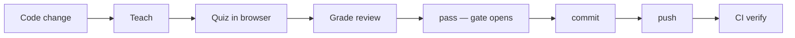
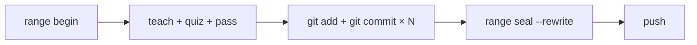
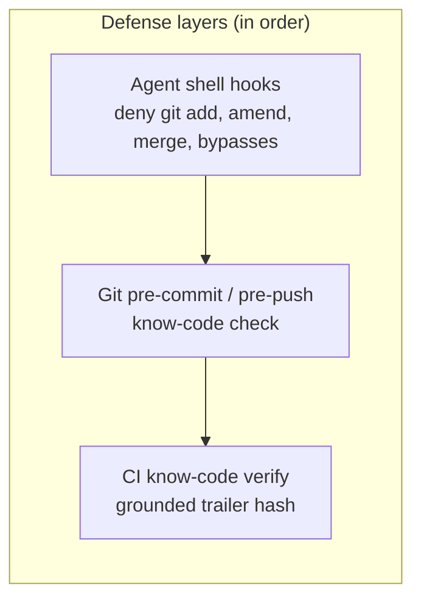
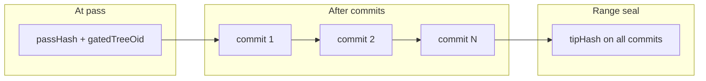

# How it works

## The problem

Coding agents can produce large diffs fast. It's easy to approve a commit you don't actually understand. know-code adds a deliberate checkpoint: **you must demonstrate comprehension before anything ships**.

## The checkpoint



Nothing in that chain is honor-system:

- The **agent** writes the quiz and proposes your score — it cannot attest `pass` for you.
- **You** answer in the browser (not chat) and seal receipts with a passphrase only you hold.
- **Hooks** block commit/push when the gate is closed.
- **CI** rejects trailers that don't match a computed hash of the real diff.

## Who does what

| Phase | Agent | You (human) |
|-------|-------|-------------|
| Start batch | — | `range begin`, `attest-init` (once) |
| Teach | Explains via `know-code-teach` skill | `taught` (seal) |
| Quiz | `questions`, write `quiz.json`, `quiz validate`, `ask` | Answer in **browser** |
| Grade | Write `grade-proposal.json` | `grade --review`, `pass` (seal) |
| Stage | — (denied in agent hooks) | `git add` in your terminal |
| Commit | `git commit` after gate opens | Or you run it yourself |
| Finish batch | — | `range seal --rewrite`, `git push` |

Commands that need your passphrase (`taught`, `grade`, `pass`, `range seal`) always run in **your** terminal — never from the agent.

## One quiz per range

`know-code range begin` pins a merge-base. **One quiz + one `pass`** covers every commit until `range seal` — you do not re-quiz per commit.



Typical batch:

1. Agent implements the feature (you may `git add` slices as you go).
2. You quiz **once** on the cumulative diff and `pass`.
3. Agent lands logical commits with **plain `git commit`** while the gate is open.
4. You `range seal --rewrite` to stamp `Know-Code-Verified` on every commit, then push.

**Tree-stable range hash:** after `pass`, committing the same gated tree keeps the range hash identical (staged-at-pass === tip tree). The gate stays open while the tree matches `gatedTreeOid`. Legacy gates or tree edits may still surface as commit-drift locally — that is not the happy path for CI.

Single-commit hotfix? Skip `range begin` — the hash covers the staged index only. See [Workflows](workflows.md) and [Verification design](verify.md).

## What blocks commit and push



| Layer | When it runs | What it checks |
|-------|--------------|----------------|
| **Agent shell hooks** | Agent tries `git commit`, `git add`, `git merge`, … | Deny bypass patterns; run `know-code check` for allowed paths |
| **Git pre-commit** | Any `git commit` / `know-code commit` | Gate open, trailer grounded, tree matches `gatedTreeOid` |
| **Git pre-push** | `git push` | Trailer on HEAD, tree still matches gate |
| **CI `verify`** | Pull request / push to main | `Know-Code-Verified` hash matches computed diff |

If commit is blocked after you passed, run `know-code status` — usually the diff changed (new edits, unstaged files, or legacy gate without `gatedTreeOid`).

## Hash scope

The quiz always binds to a **hash of the diff** you're about to ship.

| Mode | When | Hash covers |
|------|------|-------------|
| **Index** | No active range session (or `rangeMode: index`) | Empty tree → current index (staged + HEAD tree) |
| **Range** | `range begin` active (or `rangeMode: range`) | Tree diff fromOid^{tree} → `write-tree` (HEAD + staged; same after commit) |

```bash
know-code hash
know-code config --json    # shows active scope
```

## passHash, tipHash, and trailers

| Name | Meaning |
|------|---------|
| **passHash** | Diff hash stored in `gate.json` when you ran `pass` |
| **tipHash** | Current `know-code hash` (may differ after commits) |
| **trailerHash** | Value in `Know-Code-Verified:` on commit messages |

**Tree-stable tip:** after `pass`, the agent may land several commits. With the tree-canonical formula, `tipHash` matches `passHash` while the gated tree is unchanged. The gate stays open via `gatedTreeOid` until you change staged content or the working tree. `commitDrift` is for legacy/mismatched gates — not what CI uses.



**Range seal:** `range seal --rewrite` stamps the final **tipHash** on every commit in the batch so CI can verify the whole range. Use `verify --require-range-trailers` only when every commit must carry a trailer.

## Attestation

`attest-init` creates a passphrase-encrypted Ed25519 key under `~/.know-code/attest/<repoId>/`.

Signed artifacts: `taught.json`, `grade.json`, `gate.json`, `range-seal.json`. Agents can read them but cannot forge signatures without your passphrase.

## Question quota

`know-code questions` sets the minimum quiz size from level, diff size, languages, and sensitive paths. The agent must meet that bar; `ask` rejects under-sized quizzes.

## Configuration

- `~/.know-code/config.json` — optional user defaults
- `.know-code/config.json` — per-repo settings (gitignored; from `init`)
- `know-code config` — effective merged settings

Full reference: [Configuration](config.md). Notable default since 0.3.0: `enforcePipeline: true` (teach + quiz required before pass).

## Hooks (summary)

- **Git:** pre-commit / pre-push → `know-code check`
- **Agent:** deny `git add`, amend, merge/pull/rebase, hook bypasses; gate `know-code commit` and `git push`

Details: [Hooks](hooks.md)
