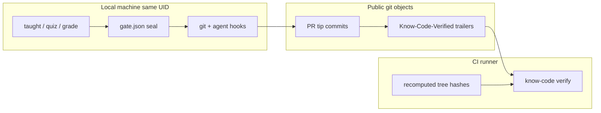

# Verification design

This page is the contract for **`know-code verify`** — what CI can prove, how hashes are computed, and how to reproduce CI locally. For the broader product loop see [How it works](how-it-works.md). For what local gates *cannot* guarantee, see the repo’s [threat model](https://github.com/chtnnh/know-code/blob/main/security/threat-model.md) (internal).

## Two jobs

| Job | When | Command | What it proves |
|-----|------|---------|----------------|
| **PR** | `pull_request` | `know-code verify` | The PR tip (or an ancestor) carries a trailer that matches merge-base → tree |
| **Push** | `push` to the base branch | `know-code verify --from` previous tip | Each landed **run** in `before..HEAD` matches its trailer |

Without `--from`, a checkout of new `main` has `aheadCount` 0 (`on base tip`) and range verify cannot match. That is why the push job always passes `github.event.before`. All-zeros `before` (new branch) skips the walk.

Locally:

```bash
know-code verify              # PR-shaped: you are ahead of origin/main
know-code verify --from HEAD^ # push-shaped: one landing on the base
```

## Threat boundary



| Artifact | Trusted in CI? | Why |
|----------|----------------|-----|
| Trailers on the PR tip / landing commits | **yes** | Public commit objects |
| `merge-base(origin/base, HEAD)` → index tree hash | **yes** | Recomputed on the runner (PR job) |
| Historical tree-pair (`--from` walk) | **yes** | Recomputed from commit trees (push job) |
| `.know-code/gate.json`, `range-seal.json` | **no** | Gitignored; agent-writable |
| Quiz score / taught seals | **no** | Local attestation only |

**Honest claim:** CI proves “this tip (PR) or each landed run (push) carries a trailer that matches a grounded tree hash.” It does **not** prove a human understood the diff, and it does not stop a same-UID agent from forging local seals.

## Hash formulas

### Index (hotfix / no active range)

`sha256("diff:" + git diff empty-tree write-tree)`

Covers **HEAD + staged** as one tree. Used when `rangeMode` is off or no range session is active.

### Range (active `range begin` or `rangeMode: range`)

```text
sha256("diff:" + git diff FROM_TREE INDEX_TREE)
```

`FROM_TREE` is the tree of the range start commit. `INDEX_TREE` is `git write-tree` (HEAD plus staged).

**Tree-canonical:** the same resulting tree hashes the same whether the delta is still staged or already committed. That is required for receipt-mode CI: `know-code commit` stamps the pass-time hash, and CI must recompute that hash from history alone (no `staged:` material, no local seal).

The formula is a **patch between two trees**. Unrelated files that exist on both sides of the range cancel out. That is why a trailer stamped against old `main` still matches after you merge or rebase onto an unrelated `main` update — as long as the feature patch itself did not change.

Sliced pathspec commits keep the same range hash while the index tree still equals `gatedTreeOid` from pass.

### Push walk (historical, no write-tree)

```text
sha256("diff:" + git diff FROM_TREE TO_TREE)
```

`FROM_TREE` / `TO_TREE` are the trees of the run start parent and the **last non-merge** in the run (the feature tip the trailer was stamped on). Attached trailerless merges stay in the run but are not the hash tip — otherwise a GitHub merge commit after `main` moved would include unrelated mainline files. A dirty index cannot change this. A run with exactly one non-merge commit (optional trailerless merges attached) also accepts the empty-tree → last-non-merge hash.

## What `verify` accepts

`collectVerifyHashCandidates` builds grounded hashes only (never “whatever string is on HEAD”):

1. **index** — empty-tree → current index tree  
2. **merge-base..HEAD** — when ahead of base: range formula from merge-base  
3. **uniform-trailers** — only if every commit shares a hash that is already a grounded candidate  
4. **range-seal** / **range-seal-pass** — only when local seal files exist and `HEAD === sealedHeadOid` (**not** available in CI)  
5. **commit-drift** — local only, when a legacy/mismatched gate hash still matches a stable gated tree  

Match order: HEAD trailer against candidates; if missing, scan trailers in `merge-base..HEAD` (PR branches whose tip is a merge commit, or a squash-bound branch whose trailer sits on an ancestor). If HEAD **is** the base tip (`aheadCount` is 0), that scan is skipped — there is no range to recompute. That is the **PR** path (`know-code verify` with no `--from`).

**Push path:** `know-code verify --from <oid>` (CI passes `github.event.before`) walks `from..HEAD` and does **not** use merge-base resolution. See [Push walk](#push-walk).

### Receipt vs rewrite

| Mode | Trailer on commits | PR job | Push job |
|------|--------------------|--------|----------|
| **receipt** (default here after tree-canonical hash) | Pass-time hash from `know-code commit` on the **tip** | Tip (or ancestor) trailer ∈ grounded candidates | Every **non-merge** in `before..HEAD` needs a trailer. GitHub **squash** (one landing) passes; a merge-commit of a tip-only PR fails |
| **rewrite** | `range seal --rewrite` stamps tip hash on every commit | Same; `--require-range-trailers` if you want that enforced on the PR | One run; tree-pair is parent-of-first → last non-merge (attached merges ignored for the hash) |

## GitHub merge methods

The **PR** job checks out the PR tip (`head.sha`). Default Actions checkout of `github.sha` on `pull_request` is the ephemeral `pull/N/merge` ref (a merge commit with no trailer); the workflow pins `head.sha` so HEAD is the tip that usually carries `Know-Code-Verified`.

The **push** job (base branch) checks out the new tip and runs `know-code verify --from` with `github.event.before` — that **is** the landing commit. See [Push walk](#push-walk).

The tree-canonical range hash plus the `merge-base..HEAD` trailer scan are what make every GitHub merge button work **on the PR**, without restamping after `main` moves.

| What you did | What CI checks out | Trailer on HEAD? | Why verify matches |
| --- | --- | --- | --- |
| Ordinary PR tip | Feature commit(s) | yes | HEAD trailer equals the merge-base..HEAD hash |
| **Update branch** (merge `main` into the PR) | Merge commit, message like `Merge branch 'main' into feat` | **no** | Range scan finds the feature trailer; hash is unchanged if the feature patch is unchanged |
| Default Actions github.sha (`pull/N/merge`) | Merge commit, message like `Merge abc into def`, first parent = base | **no** | Same range scan (workflow avoids this checkout) |
| **Squash and merge** | The PR **before** squash | yes (on the tip, or an ancestor) | Landing commit is verified on **push** (`--from`), not by this PR job |
| **Rebase and merge** | PR tip (after an author rebase: replayed commits, new SHAs, original messages) | yes | Replay keeps the trailer text; hash vs the new merge-base still matches |
| **Create a merge commit** | PR tip (possibly already a merge if you updated the branch) | maybe | Range fallback if the merge commit has no trailer |

GitHub’s default squash preset (`COMMIT_OR_PR_TITLE` + `COMMIT_MESSAGES`) usually **hoists** a column-0 `Know-Code-Verified` onto the squash landing commit (1-commit PRs keep the original body; 2+ commit PRs list `* subject` bullets, then the trailer, then `---------` / `Co-authored-by`). The PR job does not depend on that hoist; the **push** walker does (the landing commit is the run).

`PR_TITLE` + `BLANK` squash drops the trailer on the landing commit. The PR job still passes. The push job **fails** unless some other commit in `before..HEAD` carries a matching trailer.

## Assumptions

- CI config has `requireTrailer: true` and `baseBranch` matching the default branch.
- The runner has `origin/main` (full fetch). Merge-base resolution prefers `origin/main` over local `main`.
- The feature patch did not change when `main` moved (no conflict resolution that edits feature files).
- Receipt mode: at least one commit in `merge-base..HEAD` carries a grounded trailer. `--require-range-trailers` is opt-in for rewrite teams.
- Bare `know-code verify` (no `--from`) on the base tip prints `trailers: skipped full-history scan (on base tip)` and fails. That is why the push job always passes `--from`.
- Push walk is stricter than the PR scan: every **non-merge** commit in `before..HEAD` needs a trailer. Rewrite ranges and GitHub squash landings pass. A merge-commit landing of a tip-only (receipt) PR fails on push unless those commits were rewritten.

Local tests that mimic the PR path pin a dummy `origin` remote and set `refs/remotes/origin/main` to the parent SHA. They do not call GitHub.

## Push walk

After a push to the base branch, `origin/main` **is** HEAD. There is no merge-base range. GitHub still provides the previous tip as `github.event.before` (all-zeros only for a new branch).

`know-code verify --from <oid>`:

1. Fail closed if `<oid>` is not a commit, or not an ancestor of HEAD (rewritten history / missing object).
2. Exit 0 if `<oid>` is HEAD (warns `--from` is HEAD) or the zero SHA (nothing to walk).
3. Walk `from..HEAD` oldest-first (`rev-list --reverse --topo-order`).
4. Split into **runs** that share the same `Know-Code-Verified` hash. Merge commits with no trailer **attach** to the current run. A linear commit with no trailer **fails**. A merge with no current run **fails**.
5. Each run hashes the parent-of-first tree against the **last non-merge** (`computeTreePairHash` — historical trees, not live `write-tree`). Trailerless merges attach to the run but are not the hash tip, so an outdated PR landed with “Create a merge commit” still matches. The trailer must match that pair, **or** the same feature tip against a first-parent ancestor of the run start (a range that began before the previous landing — second push in the same session). A run with **exactly one non-merge** commit also accepts the empty-tree (index) hash of that feature tip.

Several landings in one push (stacked squashes) are **separate** runs. The combined `before..HEAD` patch is not a candidate — it would not match any per-range trailer.

A dirty index cannot change `--from` results.

## Workflow checklist

```yaml
on:
  pull_request:
  push:
    branches: [main]

jobs:
  verify:
    steps:
      - uses: actions/checkout@v4
        with:
          fetch-depth: 0
          ref: ${{ github.event.pull_request.head.sha || github.sha }}
      # … install know-code …
      - run: |
          mkdir -p .know-code
          printf '{\n  "level": "standard",\n  "baseBranch": "main",\n  "requireTrailer": true\n}\n' > .know-code/config.json
      - run: |
          if [ "${{ github.event_name }}" = "push" ]; then
            know-code verify --from "${{ github.event.before }}"
          else
            know-code verify
          fi
```

`know-code init --workflow` generates this shape (the composite action takes a `from` input). The action skips an all-zeros `from` (new branch). The monorepo workflow writes `requireTrailer: true` explicitly.

## Reproduce CI locally

```bash
npm run build
npm run smoke:verify
```

`scripts/smoke-verify-ci.sh` runs a full range quiz → `know-code commit`, then **deletes** gate/seal/taught artifacts and asserts `know-code verify` still exits 0, then `know-code verify --from HEAD^`. A forged trailer must fail.

## See also

- [CI & GitHub Action](ci.md) — install / branch protection  
- [How it works](how-it-works.md) — local gate + layers  
- [Workflows](workflows.md) — receipt vs rewrite  
- [Troubleshooting](troubleshooting.md) — CI trailer failures  
