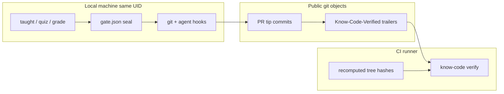

# Verification design

This page is the contract for **`know-code verify`** — what CI can prove, how hashes are computed, and how to reproduce CI locally. For the broader product loop see [How it works](how-it-works.md). For what local gates *cannot* guarantee, see the repo’s [threat model](https://github.com/chtnnh/know-code/blob/main/security/threat-model.md) (internal).

## Threat boundary



| Artifact | Trusted in CI? | Why |
|----------|----------------|-----|
| Trailers on the PR tip | **yes** | Public commit objects |
| `merge-base(origin/base, HEAD)` → index tree hash | **yes** | Recomputed on the runner |
| `.know-code/gate.json`, `range-seal.json` | **no** | Gitignored; agent-writable |
| Quiz score / taught seals | **no** | Local attestation only |

**Honest claim:** CI proves “this tip carries a trailer that matches a grounded hash of the tree ahead of base.” It does **not** prove a human understood the diff, and it does not stop a same-UID agent from forging local seals.

## Hash formulas

### Index (hotfix / no active range)

`sha256("diff:" + git diff empty-tree write-tree)`

Covers **HEAD + staged** as one tree. Used when `rangeMode` is off or no range session is active.

### Range (active `range begin` or `rangeMode: range`)

`sha256("diff:" + git diff fromOid^{tree} write-tree)`

**Tree-canonical:** the same resulting tree hashes the same whether the delta is still staged or already committed. That is required for receipt-mode CI: `know-code commit` stamps the pass-time hash, and CI must recompute that hash from history alone (no `staged:` material, no local seal).

Sliced pathspec commits keep the same range hash while the index tree still equals `gatedTreeOid` from pass.

## What `verify` accepts

`collectVerifyHashCandidates` builds grounded hashes only (never “whatever string is on HEAD”):

1. **index** — empty-tree → current index tree  
2. **merge-base..HEAD** — when ahead of base: range formula from merge-base  
3. **uniform-trailers** — only if every commit shares a hash that is already a grounded candidate  
4. **range-seal** / **range-seal-pass** — only when local seal files exist and `HEAD === sealedHeadOid` (**not** available in CI)  
5. **commit-drift** — local only, when a legacy/mismatched gate hash still matches a stable gated tree  

Match order: HEAD trailer against candidates; if missing, scan trailers in `merge-base..HEAD` (squash-friendly PR branches).

### Receipt vs rewrite

| Mode | Trailer on commits | CI needs |
|------|--------------------|----------|
| **receipt** (default here after tree-canonical hash) | Pass-time hash from `know-code commit` | Tip trailer ∈ grounded candidates |
| **rewrite** | `range seal --rewrite` stamps tip hash on every commit | Same; use `--require-range-trailers` if every commit must match |

## Workflow checklist

```yaml
on:
  pull_request:  # not push to base

jobs:
  verify:
    steps:
      - uses: actions/checkout@v4
        with:
          fetch-depth: 0
          ref: ${{ github.event.pull_request.head.sha }}  # not the merge commit
      # … install know-code …
      - run: |
          mkdir -p .know-code
          printf '{\n  "level": "standard",\n  "baseBranch": "main",\n  "requireTrailer": true\n}\n' > .know-code/config.json
      - run: know-code verify
```

`know-code init --workflow` generates the `head.sha` checkout. The composite action writes `requireTrailer: true` when it creates config; the monorepo workflow writes it explicitly.

## Reproduce CI locally

```bash
npm run build
npm run smoke:verify
```

[`scripts/smoke-verify-ci.sh`](https://github.com/chtnnh/know-code/blob/main/scripts/smoke-verify-ci.sh) runs a full range quiz → `know-code commit`, then **deletes** gate/seal/taught artifacts and asserts `know-code verify` still exits 0. A forged trailer must fail.

## See also

- [CI & GitHub Action](ci.md) — install / branch protection  
- [How it works](how-it-works.md) — local gate + layers  
- [Workflows](workflows.md) — receipt vs rewrite  
- [Troubleshooting](troubleshooting.md) — CI trailer failures  
