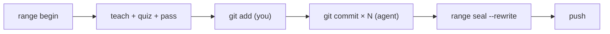
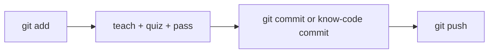

# Workflows

All workflows share the same **teach → quiz → pass** pipeline. What changes is how many commits one quiz covers.

## Range (default — one quiz per feature batch)

Use when the agent will make **2+ commits** before push.

**The point of range mode:** quiz and `pass` **once**, commit freely with plain `git`, then `range seal --rewrite` before push.



| Step | Who | Command |
|------|-----|---------|
| Start session | **You** | `know-code range begin` |
| Implement | **Agent** | edits + `know-code-teach` |
| Seal teach | **You** | `know-code taught` |
| Write quiz | **Agent** | `questions` → `.know-code/quiz.json` → `quiz validate` |
| Quiz | **Agent** runs `ask` · **you** answer in browser | `know-code ask` |
| Grade + pass | **Agent** writes `grade-proposal.json` · **you** seal | `grade --review` → `pass` |
| Stage each slice | **You** | `git add` |
| Commit each slice | **Agent** | `git commit -m "…"` (plain git, gate open) |
| Seal + ship | **You** | `range seal --rewrite` → `git push --force-with-lease` |

```bash
know-code range begin
# agent: implement + teach → you: taught
# agent: quiz + ask → you: browser → agent: grade-proposal → you: grade --review + pass

git add -A                          # you: stage slice 1
git commit -m "feat(cli): kernel"   # agent
git add -A                          # you: stage slice 2
git commit -m "fix(hooks): surface" # agent
# … repeat …

know-code range seal --rewrite
git push --force-with-lease
```

`know-code commit` adds a trailer automatically — useful for index-only hotfixes. In range mode, **`range seal --rewrite`** is how trailers land on every commit.

Next batch: `know-code range continue --yes`

## Index-only (single-commit hotfix)

No `range begin`. Quiz hash = staged index diff. One commit, then push.



| Step | Who |
|------|-----|
| Stage | **You** — `git add` |
| Pipeline | Same teach → quiz → grade → pass |
| Commit | **Agent** — `git commit` or `know-code commit` |
| Push | **You** — `git push` |

```bash
git add -p
# agent: teach → you: taught → agent: quiz + ask → you: browser
# agent: grade-proposal → you: grade --review + pass
git commit -m "hotfix: …"
git push
```

Set `rangeMode: "index"` in config to always use index scope.

## PR-first

Hooks gate `gh pr create` and `glab mr create`. Complete the quiz pipeline **before** opening the PR.

## Receipt vs rewrite

| Mode | When | What happens |
|------|------|--------------|
| **receipt** | Trailer on tip commit is enough for CI | Writes signed `range-seal.json` |
| **rewrite** | CI requires trailer on **every** commit (dogfooding default) | `range seal --rewrite` rewrites messages + `git push --force-with-lease` |

This repo dogfoods **rewrite**. Use `verify --require-range-trailers` in CI when using rewrite.

## When to `range abort`

- Wrong merge-base / started range by mistake
- `range abort` clears the session (`--keep-seal` retains `range-seal.json`)
- Does not undo commits — only local session state
