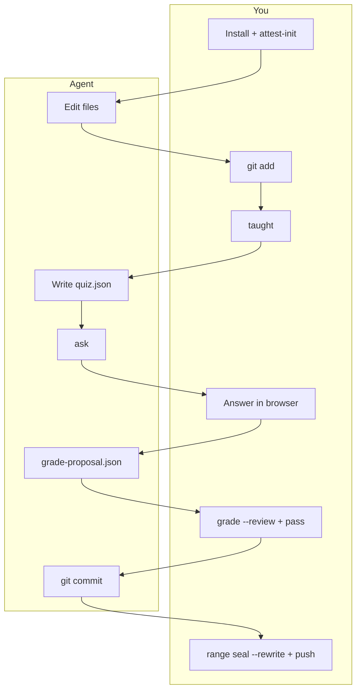

# 5-minute first gated commit

This walkthrough assumes **you** and a **coding agent** (Cursor, Claude Code, Codex, …) working in the same repo. If you work solo without an agent, you run the agent steps yourself — but you still answer the quiz in the browser; you don't rubber-stamp your own score without `grade-proposal.json`.

Prerequisites: a git repo with at least one commit on `main`, Node 20+.

## At a glance

| Step | Who | What |
|------|-----|------|
| [1. Install](#1-install-you-once) | You | CLI, hooks, attest key, skills |
| [2. Change + stage](#2-make-a-change-and-stage) | Agent edits · **you** `git add` | Code lands in the index |
| [3. Teach](#3-agent-teaches-you-seal) | Agent explains · **you** `taught` | Receipt that you were taught |
| [4. Quiz](#4-agent-writes-quiz-you-answer-in-browser) | Agent writes quiz · **you** answer in browser | Comprehension check |
| [5. Grade + pass](#5-agent-proposes-grade-you-seal) | Agent proposes · **you** `grade --review` + `pass` | Gate opens |
| [6. Commit](#6-agent-commits-plain-git) | You `git add` · Agent `git commit` | Plain git after pass |
| [7. Ship](#7-verify-and-push) | You | `range seal --rewrite`, push |



---

## 1. Install (you, once)

Run in **your** terminal:

```bash
npm i -g @chtnnh/know-code
know-code init --agents claude,cursor,codex   # git hooks + agent shell hooks
know-code attest-init                         # passphrase — seals are yours alone
know-code skills                              # teach + gate skills for the agent
```

`attest-init` creates an Ed25519 key encrypted with your passphrase. The agent cannot forge `taught`, `grade`, or `pass` without it.

---

## 2. Make a change and stage

**Agent:** edit a file (e.g. add a line to `README.md`).

**You:** stage the change in **your** terminal (not inside the agent — agent hooks deny `git add`):

```bash
git add .
```

Why you stage: the quiz hashes what's in the index. Letting the agent stage would allow changing files after the quiz without you noticing.

---

## 3. Agent teaches, you seal

**Agent:** runs the **know-code-teach** skill — explains what changed, why, and trade-offs. (If you're solo, read the diff yourself or ask your agent to explain before continuing.)

**You:** confirm you understood, then seal the teach receipt:

```bash
know-code taught
```

Enter your attest passphrase. This writes a signed `taught.json` bound to the current diff hash.

---

## 4. Agent writes quiz, you answer in browser

**Agent** — not you — authors the quiz:

```bash
know-code questions --json          # see minimum question count
# agent writes .know-code/quiz.json from the diff (see quiz.md for schema)
know-code quiz validate
know-code ask
```

`know-code ask` opens a **browser tab**. Questions are about the real diff — the agent cannot answer for you in chat.

**You:** complete the form in the browser. When you submit, `answers.json` is written locally.

---

## 5. Agent proposes grade, you seal

**Agent** reads your answers and writes `.know-code/grade-proposal.json` (proposed per-question scores and feedback).

**You:** review and attest — the agent does not self-assign the final score:

```bash
know-code grade --review    # TUI: adjust scores if needed; needs ≥80% to pass
know-code pass              # opens the gate for commit/push
```

Both commands need your attest passphrase.

---

## 6. Agent commits (plain git)

Gate open? **You** stage; **agent** commits with plain git:

```bash
git add .                             # you, in your terminal
git commit -m "docs: my first gated commit"   # agent
```

Hooks run `know-code check` on every `git commit` — no need for `know-code commit` per slice if you'll `range seal --rewrite` before push. `know-code commit` is a convenience that adds the trailer for you (handy for single-commit hotfixes).

For a multi-commit batch: repeat `git add` / `git commit` for each slice, then seal.

---

## 7. Verify and push

**You:**

```bash
know-code status
know-code range seal --rewrite    # stamps Know-Code-Verified on every commit in range
know-code doctor --strict
git push --force-with-lease
```

For multi-commit batches, start with `know-code range begin` before step 3 — see [Workflows](workflows.md).

---

## Stuck?

```bash
know-code status --json
```

Common issues: [Troubleshooting](troubleshooting.md) · Quiz format: [Quiz](quiz.md) · Grading: [Grading](grading.md)
